# Deploying Applications Into Kubernetes Cluster-101

## Project Overview

This project builds on your manually built Kubernetes cluster from the [k8s-cluster-from-ground-up](https://github.com/Munyat/k8s-cluster-from-ground-up) project. You will now learn how to deploy containerized applications on Kubernetes using essential objects: **Pods**, **Services**, **ReplicaSets**, and **Deployments**. You'll also explore different ways to expose applications (ClusterIP, NodePort) and understand how Kubernetes ensures desired state.

---

## Prerequisites

- A working Kubernetes cluster (3 masters, 3 workers) from the previous project.
- `kubectl` configured on your master node with the `admin.kubeconfig` file.
- Basic understanding of YAML syntax.
- (Optional) Docker Hub account and a custom image for the Tooling app.

---

## 1. Choosing the Right Kubernetes Cluster

For this project we are using the **from‑ground‑up cluster** you built earlier. That cluster is ideal for learning because it exposes every component and forces you to understand networking, certificates, and configuration. In production, you would likely use a managed service like Amazon EKS, but the concepts are identical.

---

## 2. Deploying a Single Pod (Nginx)

### 2.1 Create a Pod Manifest

On your **master node** (or any machine with `kubectl` pointing to your cluster), create a file `nginx-pod.yaml`:

```yaml
apiVersion: v1
kind: Pod
metadata:
  name: nginx-pod
  labels:
    app: nginx-pod
spec:
  containers:
    - image: nginx:latest
      name: nginx-pod
      ports:
        - containerPort: 80
          protocol: TCP
```

Apply it:

```bash
kubectl apply -f nginx-pod.yaml
```

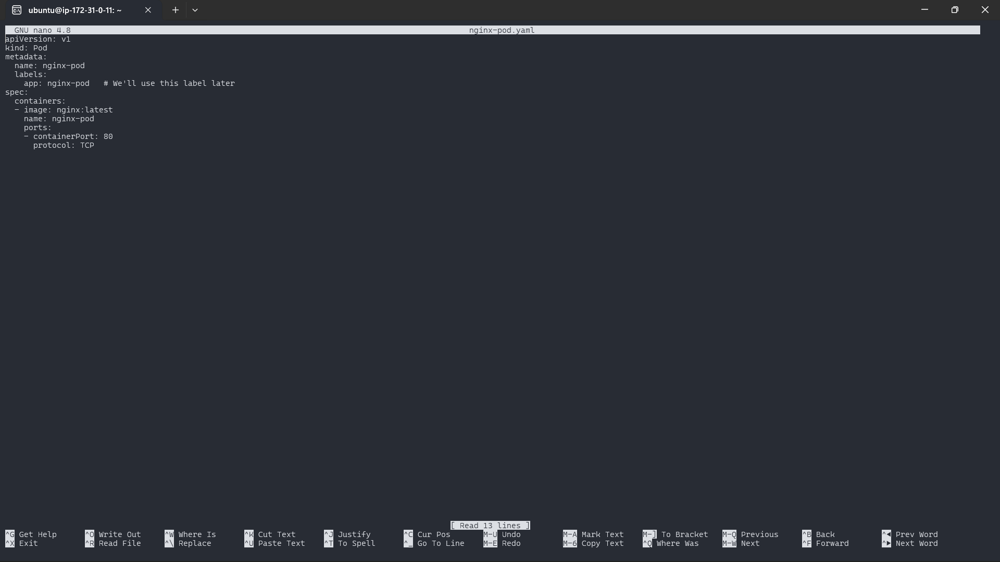

```bash
kubectl get pods -o wide
```

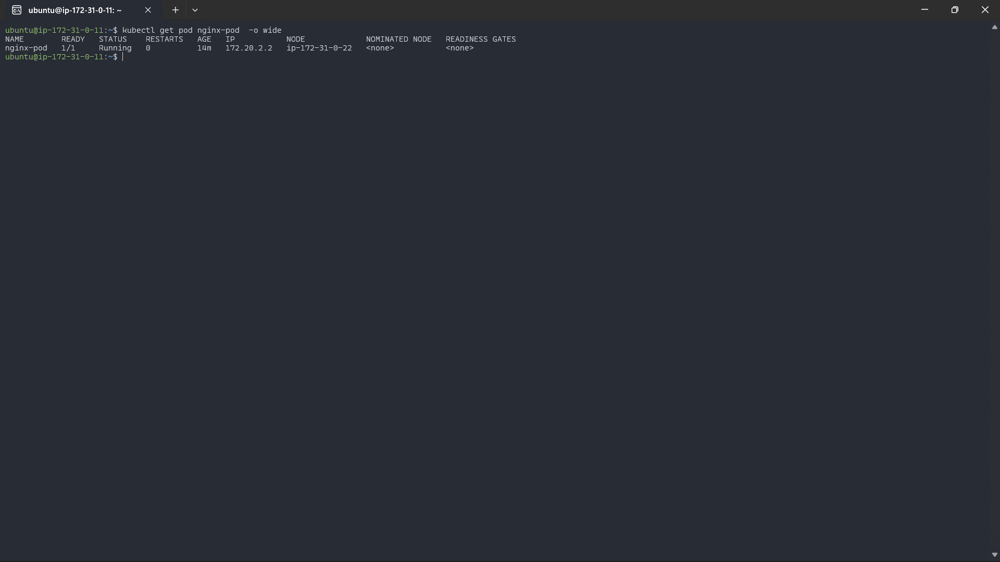

---

### 2.2 Access the Pod Internally

The pod gets an IP inside the cluster. Use a temporary `curl` pod to test it:

```bash
kubectl run curl --image=dareyregistry/curl -it --rm --restart=Never -- sh
```

Inside the container, curl the pod's IP (from `kubectl get pod nginx-pod -o wide`):

```bash
curl <pod-ip>:80
```

You should see the Nginx welcome page.

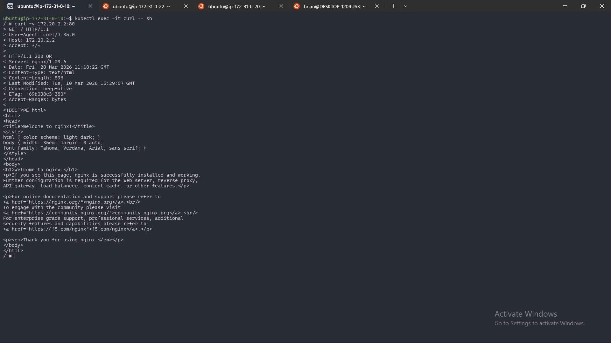

---

### 2.3 Create a Service (ClusterIP)

A service provides a stable endpoint for the pod, even if the pod is recreated with a new IP. Create `nginx-service.yaml`:

```yaml
apiVersion: v1
kind: Service
metadata:
  name: nginx-service
spec:
  selector:
    app: nginx-pod
  ports:
    - protocol: TCP
      port: 80
      targetPort: 80
```

Apply it:

```bash
kubectl apply -f nginx-service.yaml
kubectl get svc nginx-service
```

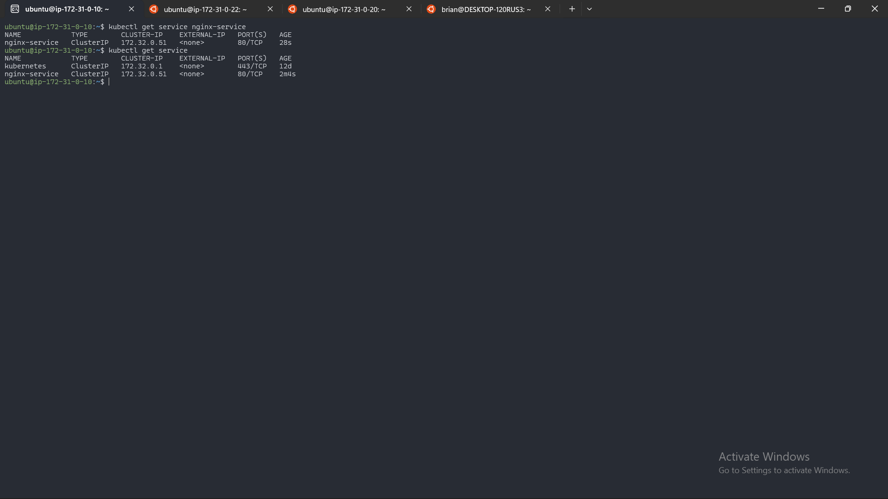

Verify the service selector matches the pod label:

```bash
kubectl get pod nginx-pod --show-labels
```

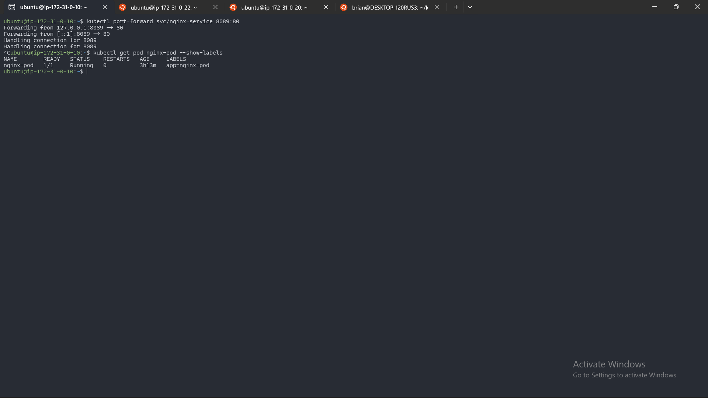

---

### 2.4 Access via Port-Forward

From your **local machine** (not the master node), forward traffic from local port 8089 to the service:

```bash
kubectl port-forward svc/nginx-service 8089:80
```

> **Important:** Always run `kubectl port-forward` from your local machine, not the master node. If you run it on the master, the browser on your laptop cannot reach it.

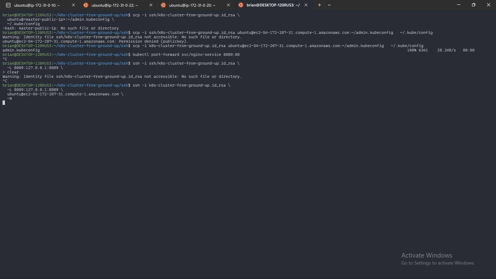

Now open your browser: `http://localhost:8089`

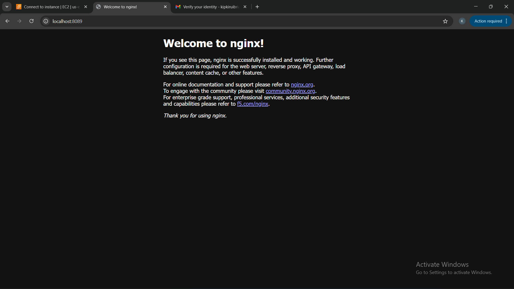

---

## 3. Using ReplicaSet to Maintain Multiple Pods

### 3.1 Delete the Single Pod

```bash
kubectl delete -f nginx-pod.yaml
```

### 3.2 Create a ReplicaSet Manifest (`nginx-rs.yaml`)

```yaml
apiVersion: apps/v1
kind: ReplicaSet
metadata:
  name: nginx-rs
spec:
  replicas: 3
  selector:
    matchLabels:
      app: nginx-pod
  template:
    metadata:
      labels:
        app: nginx-pod
    spec:
      containers:
        - image: nginx:latest
          name: nginx-pod
          ports:
            - containerPort: 80
```

Apply:

```bash
kubectl apply -f nginx-rs.yaml
```

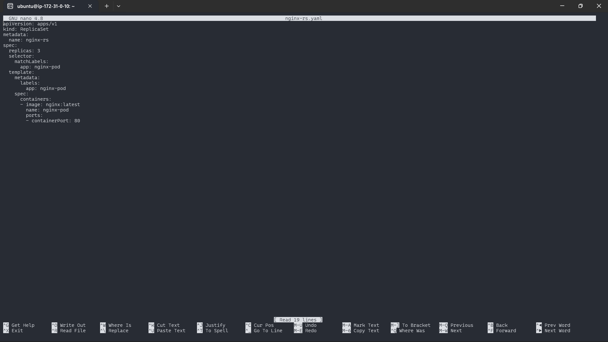

### 3.3 Verify Pods

```bash
kubectl get pods
```

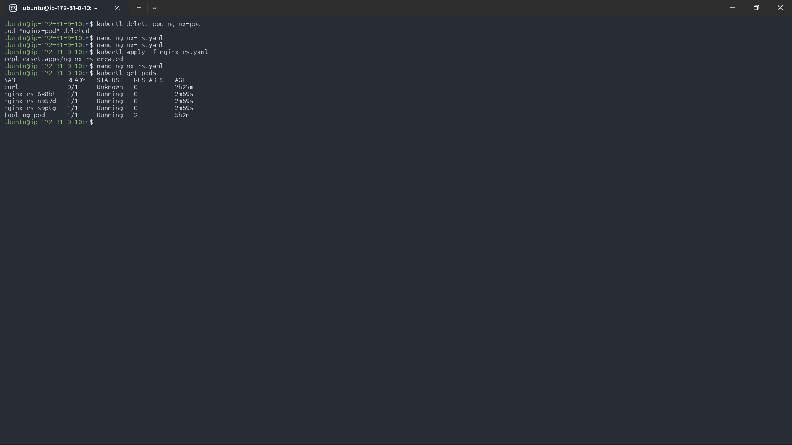

### 3.4 Scale the ReplicaSet Imperatively

```bash
kubectl scale rs nginx-rs --replicas=5
```

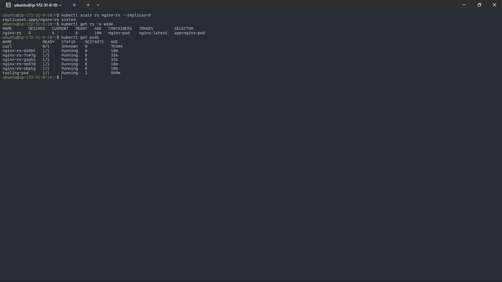

### 3.5 Describe the ReplicaSet

```bash
kubectl describe rs nginx-rs
```

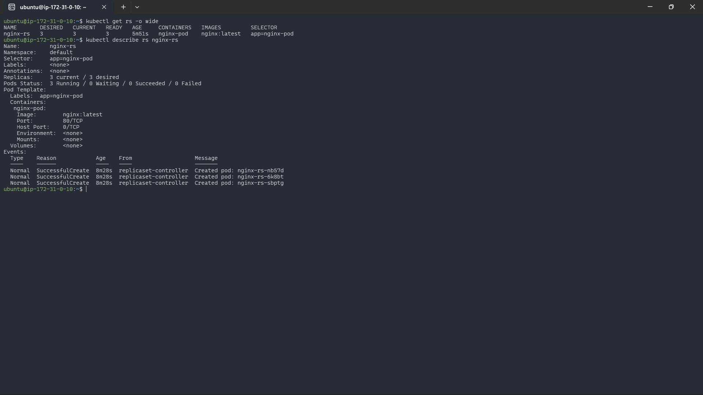

---

## 4. Deployments – The Recommended Way

### 4.1 Delete the ReplicaSet

```bash
kubectl delete rs nginx-rs
```

### 4.2 Create a Deployment Manifest (`nginx-deployment.yaml`)

```yaml
apiVersion: apps/v1
kind: Deployment
metadata:
  name: nginx-deployment
  labels:
    tier: frontend
spec:
  replicas: 3
  selector:
    matchLabels:
      tier: frontend
  template:
    metadata:
      labels:
        tier: frontend
    spec:
      containers:
        - name: nginx
          image: nginx:latest
          ports:
            - containerPort: 80
```

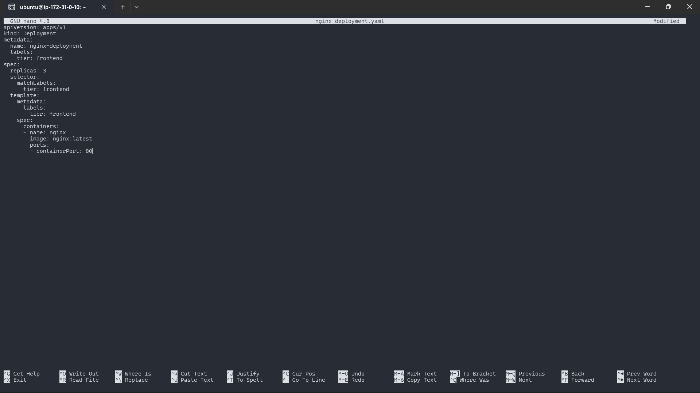

```bash
kubectl apply -f nginx-deployment.yaml
```

### 4.3 Inspect Resources

```bash
kubectl get deployments
kubectl get rs
kubectl get pods
```

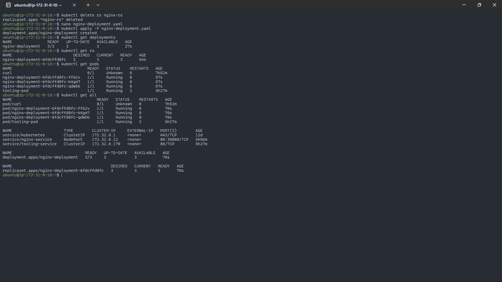

### 4.4 Scale the Deployment

```bash
kubectl scale deployment nginx-deployment --replicas=15
```

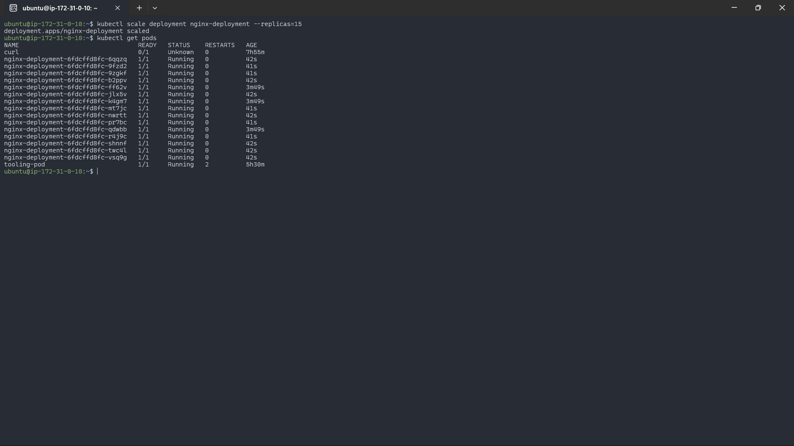

### 4.5 Exec into a Pod

```bash
# Get the pod name first
kubectl get pods -o wide | grep nginx-deployment

# Exec into the pod (replace with your actual pod name)
kubectl exec -it <pod-name> -- bash
```

Inside, explore the nginx filesystem:

```bash
ls -ltr /etc/nginx/
cat /etc/nginx/conf.d/default.conf
```

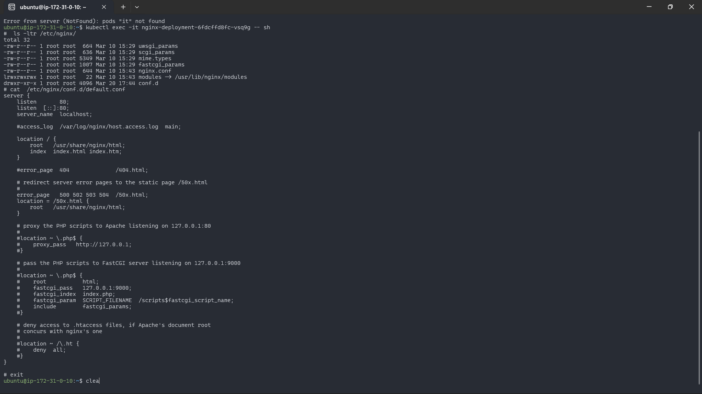

---

## 5. Exposing Services with NodePort

### 5.1 Create a NodePort Service

```yaml
apiVersion: v1
kind: Service
metadata:
  name: nginx-nodeport
spec:
  type: NodePort
  selector:
    tier: frontend
  ports:
    - protocol: TCP
      port: 80
      targetPort: 80
      nodePort: 30080
```

```bash
kubectl apply -f nginx-nodeport.yaml
kubectl get svc nginx-nodeport
```

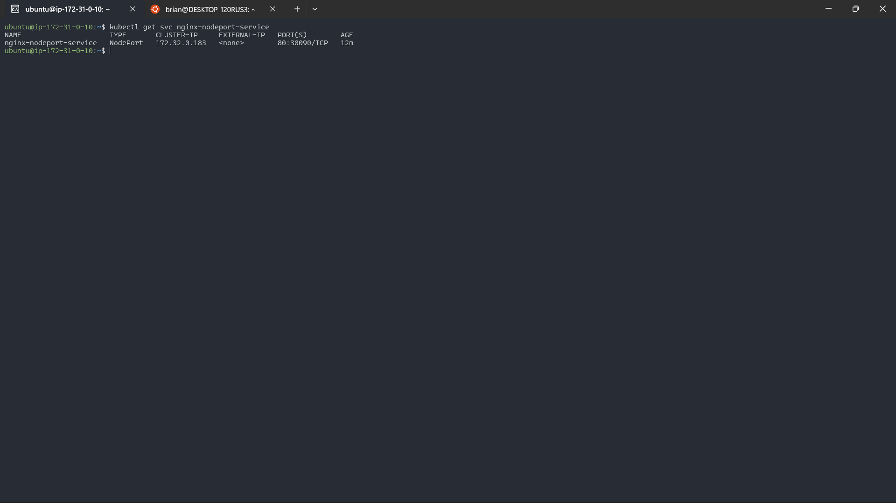

### 5.2 Access via Worker Node Public IP

1. Get the public IP of the worker where the pod is running:

```bash
kubectl get pods -o wide | grep nginx-deployment
aws ec2 describe-instances \
  --filters "Name=private-ip-address,Values=<worker-private-ip>" \
  --query 'Reservations[0].Instances[0].PublicIpAddress' \
  --output text
```

2. Ensure security group allows inbound TCP on port range `30000-32767`.

3. Open browser: `http://<worker-public-ip>:30080`

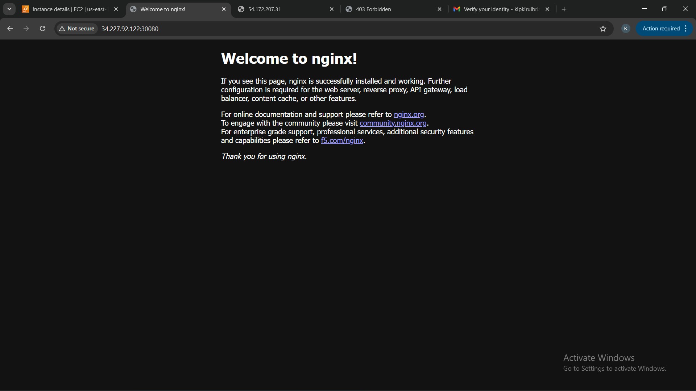

---

## 6. Tooling App (Self Task)

1. Build a Docker image and push to Docker Hub.
2. Write a Pod manifest (`tooling-pod.yaml`).
3. Write a Service manifest (ClusterIP).
4. Use port-forward to access it.

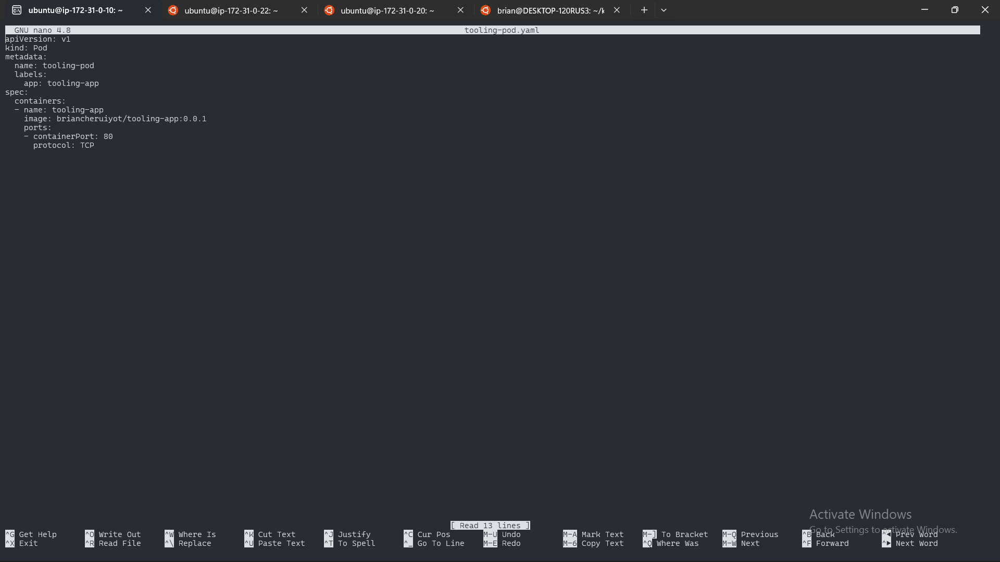

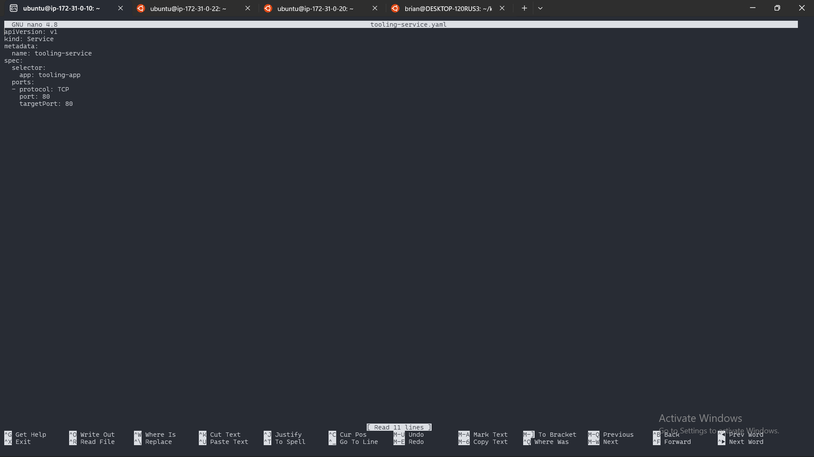

---

## 7. Persistence Demonstration

1. Scale the deployment down to 1 replica:

```bash
kubectl scale deployment nginx-deployment --replicas=1
```

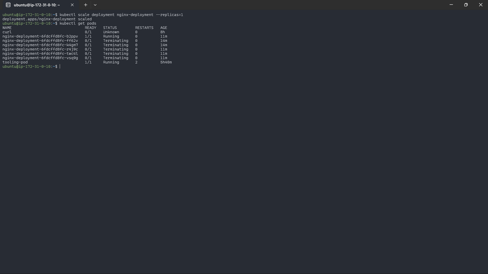

2. Exec into the pod and edit the index page:

```bash
kubectl exec -it <pod-name> -- bash

# Update the content
echo '<!DOCTYPE html>' > /usr/share/nginx/html/index.html
echo '<html><head><title>Welcome to STEGHUB.COM!</title></head>' >> /usr/share/nginx/html/index.html
echo '<body><h1>Welcome to STEGHUB.COM!</h1>' >> /usr/share/nginx/html/index.html
echo '<p>I love experiencing Kubernetes</p>' >> /usr/share/nginx/html/index.html
echo '<p><em>Thank you for learning from STEGHUB.COM</em></p>' >> /usr/share/nginx/html/index.html
echo '</body></html>' >> /usr/share/nginx/html/index.html
```

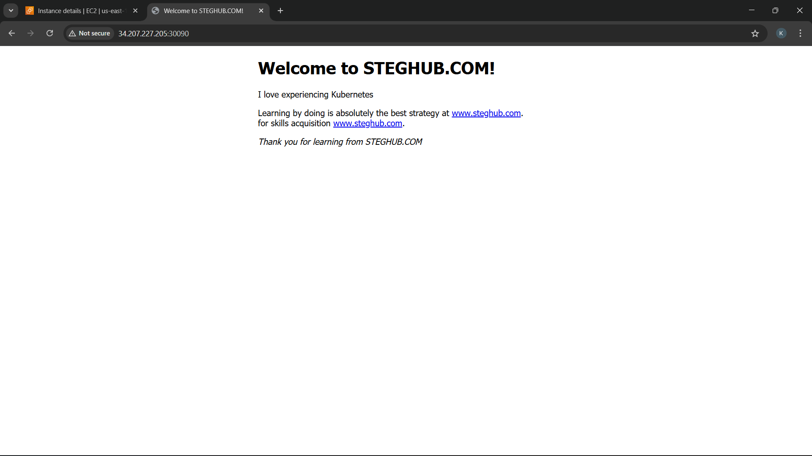

3. Delete the pod:

```bash
kubectl delete pod <pod-name>
```

4. Refresh the browser — the custom content is gone, proving pods are ephemeral.

---

## 8. Clean Up

```bash
kubectl delete deployment nginx-deployment
kubectl delete svc nginx-service nginx-nodeport
kubectl delete pod tooling-pod   # if created
```

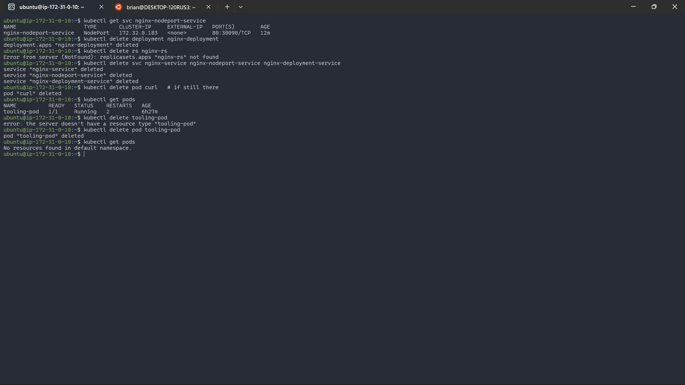

---

## Troubleshooting: Pod-to-Pod Networking Issues on AWS

### Root Cause

AWS security groups drop traffic between instances in the same group unless explicitly allowed. Without a self-referencing rule, even if iptables and routes are correct, packets are dropped at the **hypervisor level** before reaching the instance.

### The Fix

```bash
SECURITY_GROUP_ID=$(aws ec2 describe-security-groups \
  --filters "Name=group-name,Values=k8s-cluster-from-ground-up" \
  --query 'SecurityGroups[0].GroupId' --output text)

aws ec2 authorize-security-group-ingress \
  --group-id $SECURITY_GROUP_ID \
  --protocol -1 \
  --source-group $SECURITY_GROUP_ID
```

### Complete Security Group Rules Required

| Port/Protocol   | Source         | Purpose                   |
| --------------- | -------------- | ------------------------- |
| ALL traffic     | Self (same SG) | Node-to-node + pod-to-pod |
| TCP 22          | 0.0.0.0/0      | SSH                       |
| TCP 6443        | 0.0.0.0/0      | Kubernetes API            |
| TCP 2379-2380   | 172.31.0.0/24  | etcd                      |
| TCP 10250       | 172.31.0.0/24  | kubelet API               |
| TCP 30000-32767 | 0.0.0.0/0      | NodePort services         |
| ICMP -1         | 0.0.0.0/0      | Ping                      |

### Other Required Configurations

1. **Disable Source/Destination Check** on all worker nodes
2. **Add Pod CIDR routes** to the VPC route table
3. **Add OS-level routes** on each worker for other workers' pod CIDRs
4. **Enable IP forwarding** (`net.ipv4.ip_forward=1`)
5. **Add iptables FORWARD rules** for the pod CIDR

For full details, refer to the [Kubernetes Pod Networking Troubleshooting Runbook](k8s-pod-networking-troubleshooting.md) (included in the previous project).

---

## Key Concepts Learned

| Concept              | Description                                                         |
| -------------------- | ------------------------------------------------------------------- |
| **Pod**              | Smallest deployable unit; encapsulates one or more containers       |
| **Service**          | Stable network endpoint; abstracts pod IPs                          |
| **Label & Selector** | How services identify which pods to route traffic to                |
| **ReplicaSet**       | Ensures a specified number of pod replicas are always running       |
| **Deployment**       | Higher-level controller for rolling updates, scaling, and rollbacks |
| **ClusterIP**        | Internal service reachable only inside the cluster                  |
| **NodePort**         | Exposes service on a static port on every worker node               |
| **Ephemeral Pods**   | Data written inside a container is lost when the pod is deleted     |

---

## Gotchas & Lessons Learned

1. **`port-forward` must run on your local machine** — not the master node.
2. **NodePort must be accessed on a worker node IP** — not the master.
3. **Labels must match exactly** — if `kubectl get endpoints <service>` shows `<none>`, the selector does not match the pod labels.
4. **Pod CIDR routes are needed at two levels** — AWS VPC route table AND the OS routing table on each worker.
5. **The self-referencing security group rule is mandatory** — without it all inter-node traffic is silently dropped.
6. **Always set KUBECONFIG** on the master node:

```bash
export KUBECONFIG=~/admin.kubeconfig
# Or permanently:
mkdir -p ~/.kube && cp ~/admin.kubeconfig ~/.kube/config
```

---

## References

- [Kubernetes Documentation](https://kubernetes.io/docs/)
- [Kubernetes the Hard Way](https://github.com/kelseyhightower/kubernetes-the-hard-way)
- [Previous Project: k8s-cluster-from-ground-up](../k8s-cluster-from-ground-up/README.md)
